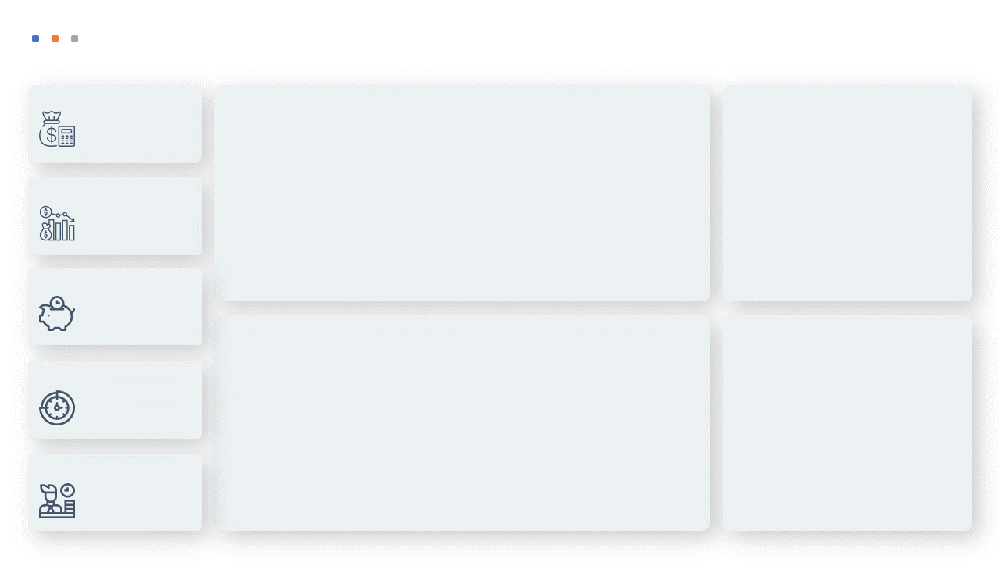
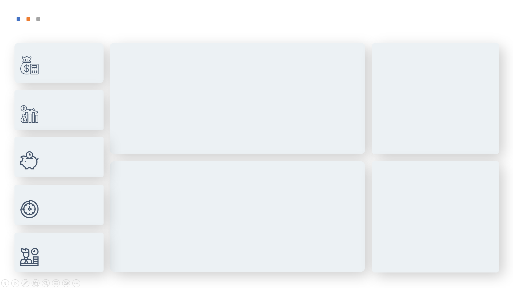
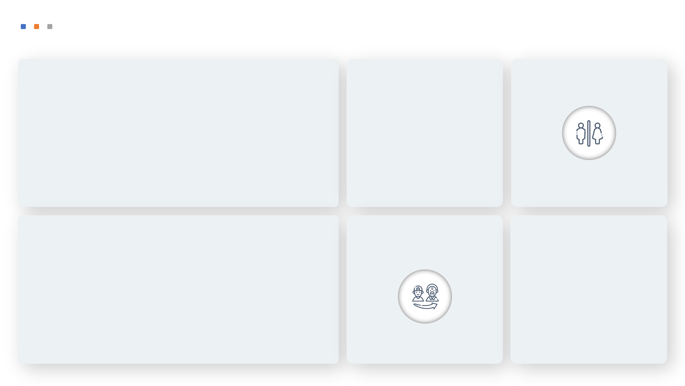

# Live0019 — Gestão de Cargos e Salários | TOTVS Protheus

> Dashboard Power BI desenvolvido para a gestão estratégica de cargos, salários e perfil do quadro de colaboradores, com integração direta ao ERP **TOTVS Protheus**.

---

## Visão Geral

Este projeto faz parte de uma série de lives de Power BI focadas em **RH Analytics** com dados reais do ERP TOTVS Protheus. O dashboard oferece uma visão 360° da estrutura de cargos e salários da organização, permitindo análises de headcount, distribuição salarial, perfil demográfico dos colaboradores e gestão de férias.

| Item | Detalhe |
|---|---|
| **Ferramenta** | Power BI Desktop |
| **ERP / Fonte** | TOTVS Protheus (SQL Server) |
| **Versões** | V1 (4,7 MB) · V2 (4,2 MB) |
| **Layouts** | Desktop e Mobile |
| **Tema visual** | Fluid Art (azul/laranja) com neumorphism |

---

## Estrutura do Projeto

```
Live0019-GestaoCargosSalarios/
│
├── Dash/
│   ├── Live0019-GestãoCargosSalariosProtheus.pbix      # Versão 1
│   └── Live0019-GestãoCargosSalariosProtheusV2.pbix    # Versão 2
│
├── Dados/
│   ├── DADOS_CARGOSSALARIOS.xlsx                        # Base de dados de cargos e salários
│   └── D_DATA.xls                                       # Tabela dimensão de datas
│
├── Imagens/
│   ├── BACKGROUND_COMPLETO.png                          # Background com cards de KPI
│   ├── BACKGROUND_COMPLETO_MARCA_.png                   # Background com marca d'água
│   ├── BACKGROUND_SIMPLES.png                           # Background limpo (desktop)
│   ├── MOBILE_BACKGROUND.png                            # Background para layout mobile
│   ├── BANNER_GRANDE.png                                # Banner do projeto
│   ├── CARD_1.png … CARD_6.png                          # Ícones dos cards de KPI
│   └── Modelo01.png … Modelo03.png                      # Wireframes de layout
│
└── Scripts/
    └── Live0019-GestaoCarloseSalarios.txt               # Queries SQL (TOTVS Protheus)
```

---

## Páginas do Dashboard

O dashboard é navegado por um menu lateral com 5 seções:

| # | Ícone | Página | Descrição |
|---|---|---|---|
| 1 | Salário/Cargos | **Visão Geral Salarial** | KPIs de headcount, massa salarial, salário médio e distribuição por cargo |
| 2 | Análise de Cargos | **Análise de Cargos** | Comparativo entre cargos, faixas salariais e enquadramento |
| 3 | Savings/Custos | **Custos e Economias** | Análise de custo por centro de custo, departamento e filial |
| 4 | Tempo de Empresa | **Tempo de Casa** | Distribuição por tempo de empresa e mapa de senioridade |
| 5 | Colaboradores | **Perfil do Colaborador** | Análise demográfica: gênero, idade, estado civil, deficiência, tipo de contrato |

---

## Fontes de Dados (TOTVS Protheus)

As queries SQL extraem dados diretamente das tabelas do módulo de RH do Protheus:

| Tabela Protheus | Conteúdo | Campos-chave |
|---|---|---|
| `SRA020` | Colaboradores | Matrícula, Cargo, Departamento, Salário, Admissão, Demissão, Situação |
| `SRH010` | Férias | Período, datas de início/fim, salário durante férias |
| `SQ3010` | Cargos | Código e descrição dos cargos |
| `SRJ010` | Funções | Código e descrição das funções |
| `SQB010` | Departamentos | Código e descrição dos departamentos |
| `SX5010` | Estado Civil | Tabela genérica `33` — estados civis |
| `CTT010` | Centros de Custo | Código, nome, bloqueio e hierarquia |
| `SRE010` | Transferências | Histórico de transferências (para cálculo de admissão efetiva) |

### Lógica de negócio aplicada nas queries

- **Anonimização**: nome do colaborador ofuscado via transformação de vogais (privacidade em ambientes de demonstração)
- **CPF / PIS / RG**: comentados intencionalmente (LGPD)
- **Situação do Funcionário**: derivada do campo `RA_SITFOLH` → Trabalhando / Afastado / Férias / Demitido
- **Faixa Etária**: cálculo dinâmico agrupado em 9 faixas (00-18 até 59+)
- **Verificação de Admissão/Demissão**: usa `SRE010` para colaboradores com RAI (transferência entre empresas), garantindo a data correta de entrada/saída
- **Periculosidade e Insalubridade**: derivados do campo `RA_ADCINS`
- **Tipo de Deficiência**: 7 categorias mapeadas a partir de `RA_TPDEFFI`

---

## Modelo de Dados

```
D_DATA ──────────────────────────────┐
                                     │
COLABORADORES (SRA020) ──┬── CARGO (SQ3010)
                         ├── FUNÇÃO (SRJ010)
                         ├── DEPARTAMENTO (SQB010)
                         ├── ESTADO CIVIL (SX5010)
                         └── CENTRO DE CUSTO (CTT010)

FÉRIAS (SRH010) ─────── COLABORADORES (via MATRÍCULA)
```

---

## Design & UX

- **Tema**: Fluid Art com tons de azul, laranja e vermelho
- **Estilo de cards**: Neumorphism (sombras internas e externas suaves)
- **Navegação**: Menu lateral com ícones de página (sidebar navigation)
- **Responsividade**: Layout mobile dedicado (`MOBILE_BACKGROUND.png`)
- **Identidade**: Backgrounds com e sem marca d'água (`BACKGROUND_COMPLETO_MARCA_.png`)

---

## Como Utilizar

### Pré-requisitos

- Power BI Desktop (versão mais recente recomendada)
- Acesso ao banco SQL Server do TOTVS Protheus (para conexão em produção)
- Ou utilizar os arquivos Excel na pasta `Dados/` para visualização sem conexão ao ERP

### Abrindo o Dashboard

1. Baixe o arquivo `.pbix` da pasta `Dash/`
2. Abra com o **Power BI Desktop**
3. Se quiser conectar ao seu Protheus: vá em `Transformar Dados` → atualize a string de conexão SQL Server
4. Se quiser usar os dados de exemplo: os arquivos Excel já estão mapeados na pasta `Dados/`

### Configurando a conexão SQL (produção)

Substitua nas queries da fonte de dados:
```
Servidor: <SEU_SERVIDOR_SQL>
Banco: <SEU_BANCO_PROTHEUS>
```
Execute as queries da pasta `Scripts/` para validar o acesso às tabelas antes de conectar.

---

## Screenshots

| Modelo 01 | Modelo 02 | Modelo 03 |
|---|---|---|
|  |  |  |

---

## Tecnologias Utilizadas


---

## Sobre o Projeto

Este dashboard foi construído durante uma sessão ao vivo (Live #019) com foco em demonstrar:

- Integração Power BI + TOTVS Protheus via Direct Query / Import
- Boas práticas de modelagem dimensional no contexto de RH
- Conformidade com LGPD na construção de relatórios com dados sensíveis
- Design profissional com themes e backgrounds customizados

---

## Autor

**Claudionei Ferreira Neves**
Data Analyst | Power BI Developer

[](https://github.com/cfneves)
[](https://github.com/cfneves/Portfolio-DataAnalytics)

---

*Projeto desenvolvido para fins educacionais e de portfólio. Dados sensíveis foram anonimizados.*
